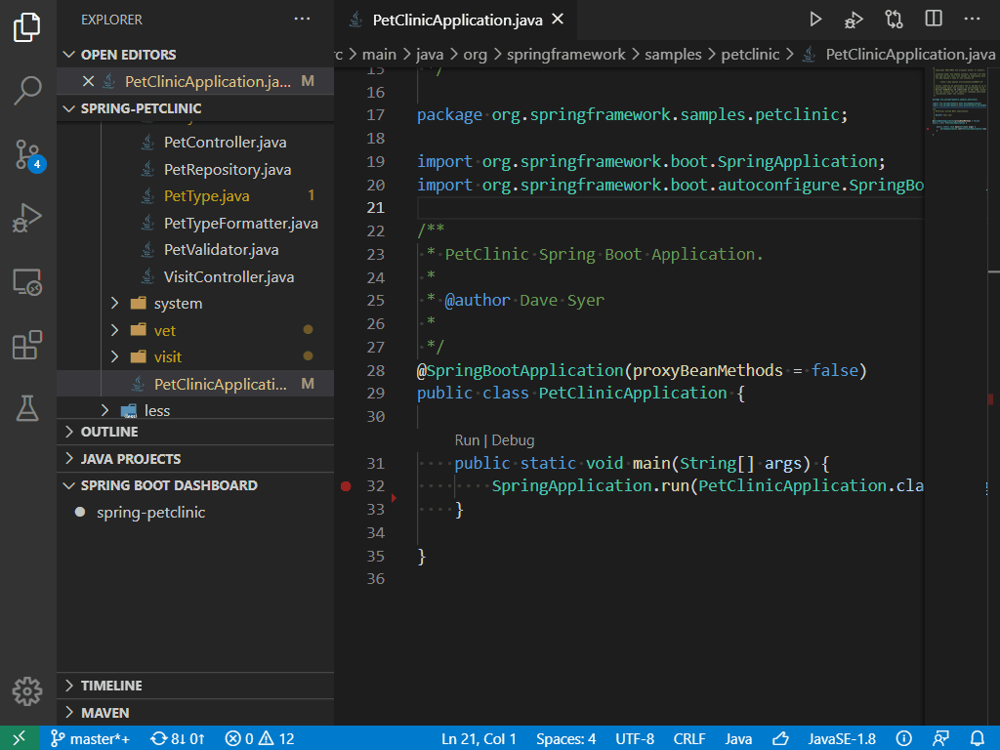

# Spring Boot Dashboard for VS Code
[](https://marketplace.visualstudio.com/items?itemName=vscjava.vscode-spring-boot-dashboard)
[](https://marketplace.visualstudio.com/items?itemName=vscjava.vscode-spring-boot-dashboard)
[](https://github.com/Microsoft/vscode-spring-boot-dashboard/blob/main/LICENSE)

Spring Boot Dashboard is a lightweight extension in Visual Studio Code (VS Code). With an explorer in the side bar, you can view and manage all available Spring Boot projects in your workspace. It also supports the features to quickly start, stop or debug a Spring Boot project. For more advanced Spring support in VS Code, please check the [Spring Boot Extension Pack](https://marketplace.visualstudio.com/items?itemName=Pivotal.vscode-boot-dev-pack).



## Feature List

* View Spring Boot apps in workspace
* Start / Stop a Spring Boot app
* Debug a Spring Boot app
* Open a Spring Boot app in browser
* List beans/endpoint mappings
* View bean dependencies

## Prerequisites
- JDK (version 1.8.0 or later)
- VS Code (version 1.19.0 or later)

## How to install

Open VS Code and press `F1` or `Ctrl + Shift + P` to open command palette, select **Install Extension** and type `vscode-spring-boot-dashboard`.

Or launch VS Code Quick Open (`Ctrl + P`), paste the following command, and press enter.
```bash
ext install vscode-spring-boot-dashboard
```
> Note: this extension has a dependency on VS Code extensions of [Debugger for Java](https://marketplace.visualstudio.com/items?itemName=vscjava.vscode-java-debug) and [Spring Boot Tools](https://marketplace.visualstudio.com/items?itemName=Pivotal.vscode-spring-boot).

## How to get started

- Launch VS Code
- Expand the Spring Boot Dashboard explorer in the side bar
- View all available Spring Boot apps in current workspace
- Right click on a certain app and choose to start, stop or debug it
- Right click on a certain app and open the website in a browser

## Data/Telemetry
VS Code collects usage data and sends it to Microsoft to help improve our products and services. Read our [privacy statement](http://go.microsoft.com/fwlink/?LinkId=521839) to learn more. If you don’t wish to send usage data to Microsoft, you can set the `telemetry.enableTelemetry` setting to `false`. Learn more in our [FAQ](https://code.visualstudio.com/docs/supporting/faq#_how-to-disable-telemetry-reporting).

## Contributing

This project welcomes contributions and suggestions.  Most contributions require you to agree to a
Contributor License Agreement (CLA) declaring that you have the right to, and actually do, grant us
the rights to use your contribution. For details, visit https://cla.microsoft.com.

When you submit a pull request, a CLA-bot will automatically determine whether you need to provide
a CLA and decorate the PR appropriately (e.g., label, comment). Simply follow the instructions
provided by the bot. You will only need to do this once across all repos using our CLA.

This project has adopted the [Microsoft Open Source Code of Conduct](https://opensource.microsoft.com/codeofconduct/).
For more information see the [Code of Conduct FAQ](https://opensource.microsoft.com/codeofconduct/faq/) or
contact [opencode@microsoft.com](mailto:opencode@microsoft.com) with any additional questions or comments.
